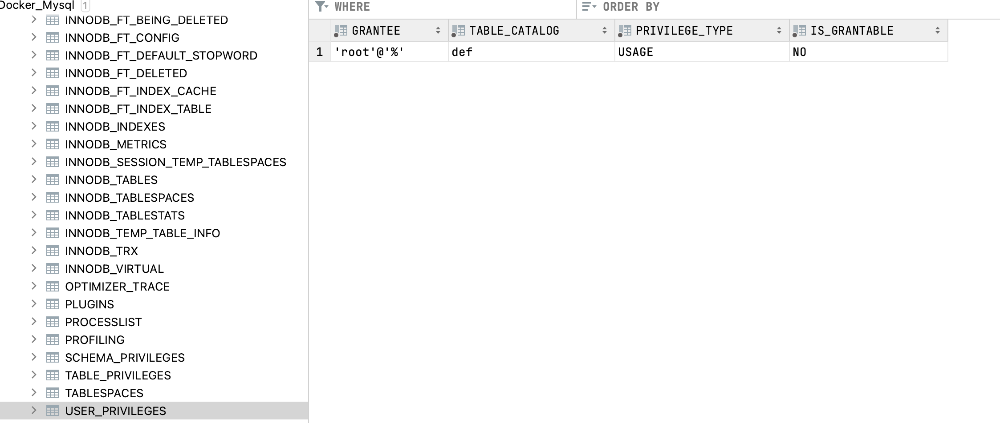

docker-compose.yml docker运行文件
test-db 数据库初始化文件

/docker-entrypoint-initdb.d目录允许扩展名为.sh, .sql and .sql.gz的文件放入其中。

如果是.sh则直接执行
如果是.sql则自动被mysql自行导入
.sql.gz文件则会先被解压，然后再被导入
如果这些类型的文件存在，将执行它们来初始化一个数据库。这些文件会按照字母的顺序执行
因此，只需要将建表脚本.sql文件，放入到/docker-entrypoint-initdb.d目录中即可。

## 2.原理
当Mysql容器首次启动时，会在 /docker-entrypoint-initdb.d目录下扫描 .sh，.sql，.sql.gz类型的文件。如果这些类型的文件存在，将执行它们来初始化一个数据库。这些文件会按照字母的顺序执行。默认情况下它们会初始化在启动容器时声明的 MYSQL_DATABASE变量定义的数据库中,例如下面的命令会初始化一个REGION_DB 数据库：

$ docker run --name some-mysql -e MYSQL_DATABASE=REGION_DB -d mysql:tag
如果你的启动命令没有指定数据库那么就必须在数据库DDL脚本中声明并指定使用该数据库。否则就会实现下面的异常：

ERROR 1046 (3D000) at line 7: No database selected
那么接下来我们将利用这一机制来实现Docker容器启动时初始化数据库。

初始化数据，目录需取docker目录
source /docker-entrypoint-initdb.d/load_departments.dump ; 

## 4. 启动
docker-compose up -d

  

## 问题记载
### 数据库没权限
1. 默认root没有授权，需先授权
  

授权命令GRANT 语句的语法如下： 
GRANT privileges (columns) 
ON what 
TO user IDENTIFIEDBY "password" 
WITH GRANT OPTION 
对用户授权 
mysql>grant rights on database.* to user@host identified by "pass"; 
例1: 
增加一个用户test1密码为abc，让他可以在任何主机上登录，并对所有数据库有查询、插入、修改、删除的权限。 
grant select,insert,update,delete on *.* to test1@"%" Identified by "abc"; 
ON 子句中*.* 说明符的意思是“所有数据库，所有的表” 
例2: 
增加一个用户test2密码为abc, 让他只可以在localhost上登录，并可以对数据库mydb进行查询、插入、修改、删除的操作。 
grant select,insert,update,delete on mydb.* to test2@localhost identified by "abc"; 